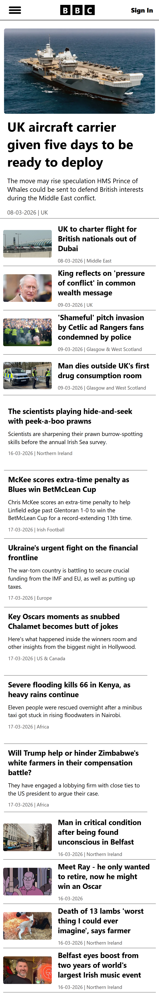
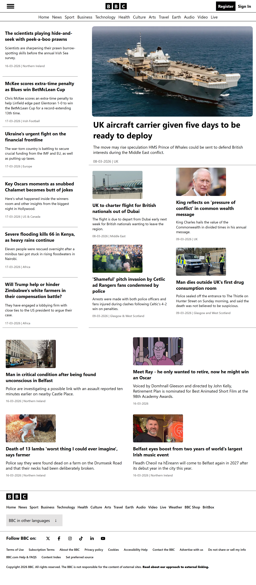
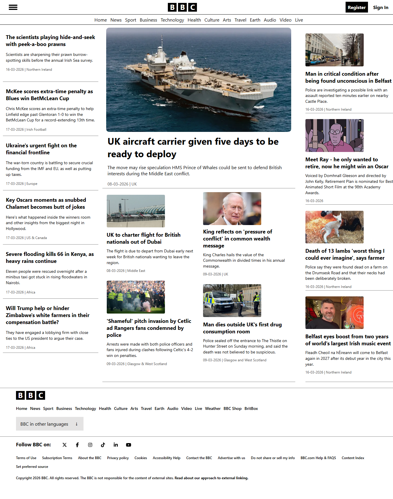

# BBC News Responsive Clone

> A pixel-perfect, mobile-first web layout built with pure CSS Grid and Flexbox, focusing on complex media query management and DRY architecture.

## Key Features

* **Mobile-First Design:** Fully responsive from 320px up to 1280px+ desktop monitors.
* **Complex Grid Logic:** Implemented 2x2 and 2x3 grid systems that adapt fluidly across breakpoints.
* **Interactive UI without JS:** Utilized the pure CSS Checkbox hack (`:checked`) for dynamic dropdowns and mobile navigation toggles.
* **Optimized Architecture:** Strictly followed DRY (Don't Repeat Yourself) principles to reduce code redundancy, specifically condensing footer and social section styling.

## Challenges & Solutions

| Challenge | Solution |
| :--- | :--- |
| **Tablet/Desktop DOM Ordering:** Swapping column positions on tablet vs. desktop views while maintaining a logical source order in the HTML. | Used explicit `grid-column` and `grid-row` placement to visually reorder elements without breaking SEO and accessibility standards. |
| **Dynamic Height Shifts in Footer:** Toggling the 'Other Languages' and 'Social Links' menus caused unexpected layout shifts, pushing icons upwards or creating unwanted blank space. | Implemented `flex-wrap: wrap` on the parent containers and stabilized the dimensional properties to ensure smooth toggle states without layout breakage. |

## Tech Stack

* **HTML5:** Semantic architecture (`<article>`, `<header>`, `<nav>`, `<footer>`)
* **CSS3:** CSS Grid, Flexbox, Custom CSS Variables (`:root`), State pseudo-classes, and Media Queries.

## Visual Previews (Click to Expand)

<b>Mobile View (Base)</b>

<b>Small Tablet View (768px)</b>

<b>Large Tablet View (1024px)</b>

<b>Desktop View (1280px+)</b>

## How to Run Locally

1. Clone the repository: `git clone https://github.com/yourusername/bbc-news-clone.git`
2. Navigate to the project directory.
3. Open `index.html` in your preferred web browser. No local server required.
